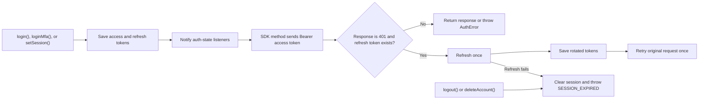

<!-- markdownlint-disable MD013 MD033 MD036 MD041 -->

<a id="top"></a>

<div align="center">

# TypeScript SDK

**A typed client for authentication, session persistence, React state, OAuth redirects, MFA, and account management**

[](https://www.npmjs.com/package/@authserver/client)
[](../../clients/ts/src)
[](#react-quick-start)
[](../../LICENSE)

[Quick start](#quick-start) | [React](#react-quick-start) | [Node.js](#nodejs-quick-start) | [Core API](#authclient-api) | [React API](#react-api) | [Types](#type-reference)

</div>

---

## At a Glance

| Capability | Behavior |
| --- | --- |
| Package | `@authserver/client` |
| Main import | `@authserver/client` |
| React import | `@authserver/client/react` |
| Module formats | ESM and CommonJS |
| Default session storage | Memory |
| Browser persistence | `localStorage` or `sessionStorage` |
| React peer dependency | React and React DOM `>=18.0.0` |
| Network runtime | A global Fetch API implementation |
| Source of truth | [`clients/ts/src`](../../clients/ts/src) |

The SDK attaches the current access token to its requests whenever one is present, refreshes and retries once after a `401` response when a refresh token is available, and reports failures through `AuthError`.

Installation commands resolve the published package. This reference follows the SDK source in the current repository checkout.

> [!IMPORTANT]
> `clientId` is required by the constructor, including for email/password integrations. It identifies OAuth provider configuration and forms part of the default storage key. Create or retrieve a client through `POST /api/auth/oauth/clients`; OAuth client management is not exposed by this SDK.

## Current Repository Compatibility

This guide documents the public contract exported by the TypeScript SDK in this repository.

Validate the deployed API contract before using the SDK in production. See the [OpenAPI specification](../swagger.yaml), [SDK types](../../clients/ts/src/types.ts), and [server DTOs](../../internal/dto/auth_dto.go) when aligning an integration.

## Installation

Install the core client with your package manager:

```bash
npm install @authserver/client
```

```bash
pnpm add @authserver/client
```

```bash
yarn add @authserver/client
```

For React applications, React and React DOM must also be installed:

```bash
npm install @authserver/client react react-dom
```

### Runtime Requirements

- Browsers must provide `fetch`, `Headers`, `localStorage`, and `sessionStorage` for the features they use.
- Node.js must provide the global Fetch API. Node.js 18 and later include it.
- Server-side code should use the default `memory` storage.
- React bindings require React and React DOM `>=18.0.0`.

### Build the Workspace Package

For local SDK development from this repository:

```bash
cd clients/ts
npm ci
npm run build
```

The build writes ESM, CommonJS, and declaration files to `clients/ts/dist`.

## Quick Start

Create one client for a browser application:

```ts
import { AuthClient, AuthError } from '@authserver/client';

export const auth = new AuthClient({
  serverUrl: 'https://auth.example.com',
  clientId: 'your-oauth-client-id',
  storage: 'localStorage',
});

try {
  const session = await auth.login('ada@example.com', 'correct-horse-battery-staple');
  console.log('Signed in:', session.user?.email);
} catch (error) {
  if (error instanceof AuthError) {
    console.error(error.code, error.status, error.message);
  } else {
    throw error;
  }
}
```

`serverUrl` must be the auth server origin, without `/api`:

```ts
const auth = new AuthClient({
  serverUrl: 'http://localhost:3000',
  clientId: 'your-oauth-client-id',
});
```

The constructor removes one trailing slash from `serverUrl`. All SDK requests are sent beneath `/api/auth`.

### Observe Session Changes

`onAuthStateChanged()` runs the callback immediately, then runs it again whenever the client saves or clears a session:

```ts
const unsubscribe = auth.onAuthStateChanged((session) => {
  if (session) {
    console.log('Session available');
  } else {
    console.log('Signed out');
  }
});

// Remove the listener when it is no longer needed.
unsubscribe();
```

When a persisted session is restored, the initial callback contains tokens but does not contain a user profile. Call `getUser()` when the profile is needed.

### Call Another API with the Access Token

The SDK automatically attaches tokens only to its own methods. Use `getAccessToken()` when calling a separate protected service:

```ts
const response = await fetch('https://api.example.com/orders', {
  headers: {
    Authorization: `Bearer ${auth.getAccessToken()}`,
  },
});
```

Check for `null` before sending the header in production code.

## React Quick Start

The React entry point exports `AuthProvider` and `useAuth`.

### 1. Create a Stable Client

Create the client outside React components so renders do not replace the active client and its listeners:

```ts
// auth.ts
import { AuthClient } from '@authserver/client';

export const authClient = new AuthClient({
  serverUrl: 'https://auth.example.com',
  clientId: 'your-oauth-client-id',
  storage: 'localStorage',
});
```

### 2. Add the Provider

```tsx
// App.tsx
import { AuthProvider } from '@authserver/client/react';
import { authClient } from './auth';
import { Account } from './Account';

export function App() {
  return (
    <AuthProvider client={authClient}>
      <Account />
    </AuthProvider>
  );
}
```

### 3. Read and Change Auth State

```tsx
// Account.tsx
import { useState, type FormEvent } from 'react';
import { AuthError } from '@authserver/client';
import { useAuth } from '@authserver/client/react';

export function Account() {
  const { user, isAuthenticated, isLoading, login, logout } = useAuth();
  const [errorMessage, setErrorMessage] = useState('');

  async function handleLogin(event: FormEvent<HTMLFormElement>) {
    event.preventDefault();
    const form = new FormData(event.currentTarget);

    try {
      setErrorMessage('');
      await login(String(form.get('email')), String(form.get('password')));
    } catch (error) {
      setErrorMessage(
        error instanceof AuthError ? error.message : 'Unable to sign in',
      );
    }
  }

  if (isLoading) return <p>Loading session...</p>;

  if (!isAuthenticated) {
    return (
      <form onSubmit={handleLogin}>
        <input name="email" type="email" autoComplete="email" required />
        <input
          name="password"
          type="password"
          autoComplete="current-password"
          required
        />
        <button type="submit">Sign in</button>
        {errorMessage && <p role="alert">{errorMessage}</p>}
      </form>
    );
  }

  return (
    <section>
      <p>Signed in as {user?.email ?? 'current user'}</p>
      <button type="button" onClick={() => void logout()}>
        Sign out
      </button>
    </section>
  );
}
```

`AuthProvider` subscribes to the client, restores session state, and fetches the current user when a restored session does not include one.

> [!CAUTION]
> Never share a token-bearing `AuthClient` singleton across users in a Node.js server process. For server-side rendering, create a client per request and keep the default `memory` storage.

## Node.js Quick Start

In Node.js, storage always behaves as memory storage because browser storage is unavailable:

```ts
import { AuthClient, AuthError } from '@authserver/client';

const auth = new AuthClient({
  serverUrl: process.env.AUTH_SERVER_URL ?? 'http://localhost:3000',
  clientId: process.env.AUTH_CLIENT_ID ?? 'local-node-client',
});

try {
  await auth.login(
    process.env.AUTH_EMAIL ?? '',
    process.env.AUTH_PASSWORD ?? '',
  );

  const user = await auth.getUser();
  console.log(`Authenticated as ${user.email}`);
} catch (error) {
  if (error instanceof AuthError) {
    console.error({
      code: error.code,
      status: error.status,
      message: error.message,
    });
    process.exitCode = 1;
  } else {
    throw error;
  }
} finally {
  await auth.logout();
}
```

For a long-running multi-user service, create a separate client for each isolated session. The SDK does not provide a server-side session store adapter.

## Configuration

### `AuthClientConfig`

```ts
interface AuthClientConfig {
  serverUrl: string;
  clientId: string;
  storage?: 'localStorage' | 'sessionStorage' | 'memory';
  storageKey?: string;
}
```

| Option | Required | Default | Description |
| --- | --- | --- | --- |
| `serverUrl` | Yes | None | Auth server origin, such as `https://auth.example.com`. Do not include `/api`. |
| `clientId` | Yes | None | OAuth client ID. It is also used in the default storage key. |
| `storage` | No | `'memory'` | Token persistence strategy. Browser storage is ignored outside a browser. |
| `storageKey` | No | `auth_session_<clientId>` | Key used for a persisted token pair. |

The constructor throws a plain `Error` when `serverUrl` or `clientId` is missing.

### Storage Comparison

| Storage | Survives reload | Survives tab close | Browser only | Typical use |
| --- | --- | --- | --- | --- |
| `memory` | No | No | No | Node.js, SSR, short-lived sessions |
| `sessionStorage` | Yes | No | Yes | Per-tab browser sessions |
| `localStorage` | Yes | Yes | Yes | Persistent browser sessions |

Only `access_token` and `refresh_token` are persisted. The user profile is fetched again when required.

> [!CAUTION]
> `localStorage` and `sessionStorage` tokens are readable by JavaScript running on the page. Apply a strict Content Security Policy, prevent cross-site scripting, avoid logging tokens, and choose the shortest persistence period your application needs.

## Session Lifecycle



Important details:

- Refresh is reactive. It happens after an SDK request receives `401`; there is no background refresh timer.
- Concurrent calls to `refresh()` share one in-flight refresh request.
- The retried request is attempted once.
- `isAuthenticated()` checks the access token's JWT `exp` claim with a five-second expiry buffer.
- A malformed token, a token without a decodable payload, or a token that cannot be decoded is treated as expired.
- `logout()` always clears local session state, even if server-side logout fails.
- `logoutAll()` clears local session state only after its server request succeeds.

## Error Handling

API and network failures are represented by `AuthError`:

```ts
import { AuthError } from '@authserver/client';

try {
  await auth.getUser();
} catch (error) {
  if (error instanceof AuthError) {
    switch (error.code) {
      case 'NETWORK_ERROR':
        console.error('The auth server could not be reached');
        break;
      case 'SESSION_EXPIRED':
        console.error('Sign in again');
        break;
      default:
        console.error(error.message);
    }
  }
}
```

```ts
class AuthError extends Error {
  code: string;
  status: number;
}
```

| Client-generated code | Status | Meaning |
| --- | ---: | --- |
| `NETWORK_ERROR` | `0` | The request could not reach the auth server. |
| `SESSION_EXPIRED` | `401` | A request returned `401` and automatic refresh failed. |
| `NO_REFRESH_TOKEN` | `401` | `refresh()` was called without a stored refresh token. |
| `BROWSER_ONLY` | `0` | A social-login redirect method was called outside a browser. |
| `API_ERROR` | HTTP status | The server returned an error without its own error code. |

When the server returns `error.code`, the SDK preserves it. Constructor validation errors are plain `Error` instances.

## AuthClient API

### Authentication and Session

| Method | Returns | Description |
| --- | --- | --- |
| `register(email, password, firstName, lastName)` | `Promise<ApiResponse<User>>` | Registers a user. Unlike most convenience methods, returns the full API response envelope. |
| `login(email, password)` | `Promise<Session>` | Signs in and saves the returned session. |
| `loginMfa(email, code)` | `Promise<Session>` | Completes MFA login and saves the returned session. |
| `refresh()` | `Promise<Session>` | Rotates tokens using the stored refresh token. Concurrent calls are deduplicated. |
| `logout()` | `Promise<void>` | Attempts server-side logout and always clears the local session. |
| `logoutAll()` | `Promise<void>` | Revokes all sessions and clears the local session after success. |
| `setSession(session)` | `void` | Saves an externally acquired session and notifies listeners. |
| `getAccessToken()` | `string \| null` | Returns the current access token. |
| `getRefreshToken()` | `string \| null` | Returns the current refresh token. |
| `isAuthenticated()` | `boolean` | Returns whether a present access token appears unexpired. |
| `onAuthStateChanged(callback)` | `() => void` | Runs immediately, subscribes to session changes, and returns an unsubscribe function. |

#### `setSession(session)`

Use `setSession()` when another trusted flow has already obtained tokens:

```ts
auth.setSession({
  access_token: accessToken,
  refresh_token: refreshToken,
});
```

Calling `setSession()` with a session that omits `refresh_token` preserves any refresh token already held by the client.

### OAuth Redirects

| Method | Returns | Environment | Description |
| --- | --- | --- | --- |
| `loginWithGoogle()` | `void` | Browser only | Redirects to `/api/auth/google/login?client_id=...`. |
| `loginWithGitHub()` | `void` | Browser only | Redirects to `/api/auth/github/login?client_id=...`. |

```ts
googleButton.addEventListener('click', () => auth.loginWithGoogle());
githubButton.addEventListener('click', () => auth.loginWithGitHub());
```

These methods begin a redirect. They do not return a `Session`.

### User and Account

| Method | Returns | Description |
| --- | --- | --- |
| `getUser()` | `Promise<User>` | Gets the authenticated user's profile. |
| `updateProfile(firstName?, lastName?)` | `Promise<User>` | Updates either or both profile names. |
| `changePassword(currentPassword, newPassword)` | `Promise<void>` | Changes the authenticated user's password. |
| `deleteAccount()` | `Promise<void>` | Deletes the account and clears the local session after success. |

### Verification and Password Reset

| Method | Returns | Description |
| --- | --- | --- |
| `verifyEmail(token)` | `Promise<void>` | Verifies an email address using a token. |
| `resendVerification(email)` | `Promise<void>` | Requests another verification email. |
| `forgotPassword(email)` | `Promise<void>` | Requests a password-reset email. |
| `resetPassword(token, password)` | `Promise<void>` | Sets a new password using a reset token. |

### MFA

| Method | Returns | Description |
| --- | --- | --- |
| `enableMfa()` | `Promise<{ secret: string; qr_code: string }>` | Starts TOTP setup and returns setup material. |
| `verifyMfa(code)` | `Promise<void>` | Verifies a six-digit TOTP code and completes setup. |
| `loginMfa(email, code)` | `Promise<Session>` | Signs in with a six-digit TOTP code and saves the session. |

```ts
const setup = await auth.enableMfa();

// Display setup.qr_code with a QR-code renderer, then collect a TOTP code.
await auth.verifyMfa('123456');
```

Do not log or persist the MFA secret in application telemetry.

### Sessions and Audit Logs

| Method | Returns | Description |
| --- | --- | --- |
| `getSessions()` | `Promise<SessionInfo[]>` | Lists active sessions for the authenticated user. |
| `revokeSession(sessionId)` | `Promise<void>` | Revokes one session by ID. |
| `getAuditLogs()` | `Promise<AuditLog[]>` | Lists audit events for the authenticated user. |

## React API

Import React bindings from the dedicated subpath:

```tsx
import { AuthProvider, useAuth } from '@authserver/client/react';
```

### `AuthProvider`

```tsx
function AuthProvider(props: {
  client: AuthClient;
  children: React.ReactNode;
}): React.JSX.Element;
```

The provider:

- subscribes to `client.onAuthStateChanged()`;
- stores the current `session` and `user`;
- fetches the user profile when a restored session contains no user;
- exposes convenience `login`, `logout`, and `refreshUser` functions.

### `useAuth()`

`useAuth()` must be called below `AuthProvider`. It throws a plain `Error` otherwise.

| Value | Type | Description |
| --- | --- | --- |
| `client` | `AuthClient` | Underlying client for the full SDK API. |
| `session` | `Session \| null` | Current session known to the provider. |
| `user` | `User \| null` | Current user profile known to the provider. |
| `isAuthenticated` | `boolean` | `true` when the provider currently holds a session. |
| `isLoading` | `boolean` | `true` while initial session/user resolution is in progress. |
| `login` | `(email, password) => Promise<Session>` | Calls `client.login()`. |
| `logout` | `() => Promise<void>` | Calls `client.logout()`. |
| `refreshUser` | `() => Promise<void>` | Fetches and stores the latest user profile. |

> [!NOTE]
> React's `isAuthenticated` value means the provider has a non-null session. It does not call `client.isAuthenticated()` and does not independently inspect token expiry.

## Type Reference

All types below are exported from `@authserver/client`.

### `Session`

```ts
interface Session {
  access_token: string;
  refresh_token?: string;
  user?: User;
}
```

### `User`

```ts
interface User {
  id: string;
  email: string;
  first_name: string;
  last_name: string;
  is_verified: boolean;
  role: string;
  created_at: string;
  updated_at: string;
  mfa_enabled: boolean;
  profile_image?: string;
}
```

### `ApiResponse<T>`

```ts
interface ApiResponse<T = any> {
  success: boolean;
  message: string;
  data: T;
  error?: {
    message?: string;
    code?: string;
  };
}
```

### `SessionInfo`

```ts
interface SessionInfo {
  id: string;
  ip_address: string;
  user_agent: string;
  created_at: string;
  expires_at: string;
  is_current: boolean;
}
```

### `AuditLog`

```ts
interface AuditLog {
  id: string;
  action: string;
  ip_address: string;
  user_agent: string;
  created_at: string;
}
```

### `AuthStateChangeCallback`

```ts
type AuthStateChangeCallback = (session: Session | null) => void;
```

## Import Reference

```ts
import {
  AuthClient,
  AuthError,
  type ApiResponse,
  type AuditLog,
  type AuthClientConfig,
  type AuthStateChangeCallback,
  type Session,
  type SessionInfo,
  type User,
} from '@authserver/client';

import { AuthProvider, useAuth } from '@authserver/client/react';
```

## Production Checklist

- Use HTTPS for the auth server and every token-consuming service.
- Keep `serverUrl` and `clientId` in environment-specific configuration.
- Confirm the deployed server and SDK use the same request and response field names.
- Use `memory` storage for server-side and high-sensitivity contexts.
- Do not share an `AuthClient` instance between server-side users.
- Treat access tokens, refresh tokens, MFA secrets, and reset tokens as credentials.
- Handle `AuthError` without exposing sensitive server details to end users.
- Configure Content Security Policy and cross-origin settings for browser applications.
- Test login, token rotation, logout, expiry, MFA, and social-login callbacks before release.

## Source and Further Reading

- [SDK section index](./README.md)
- [TypeScript SDK source](../../clients/ts/src)
- [`AuthClient` implementation](../../clients/ts/src/AuthClient.ts)
- [React bindings](../../clients/ts/src/react/index.tsx)
- [Exported SDK types](../../clients/ts/src/types.ts)
- [Interactive REST API documentation](../index.html)
- [OpenAPI specification](../swagger.yaml)

<p align="right"><a href="#top">Back to top</a></p>
